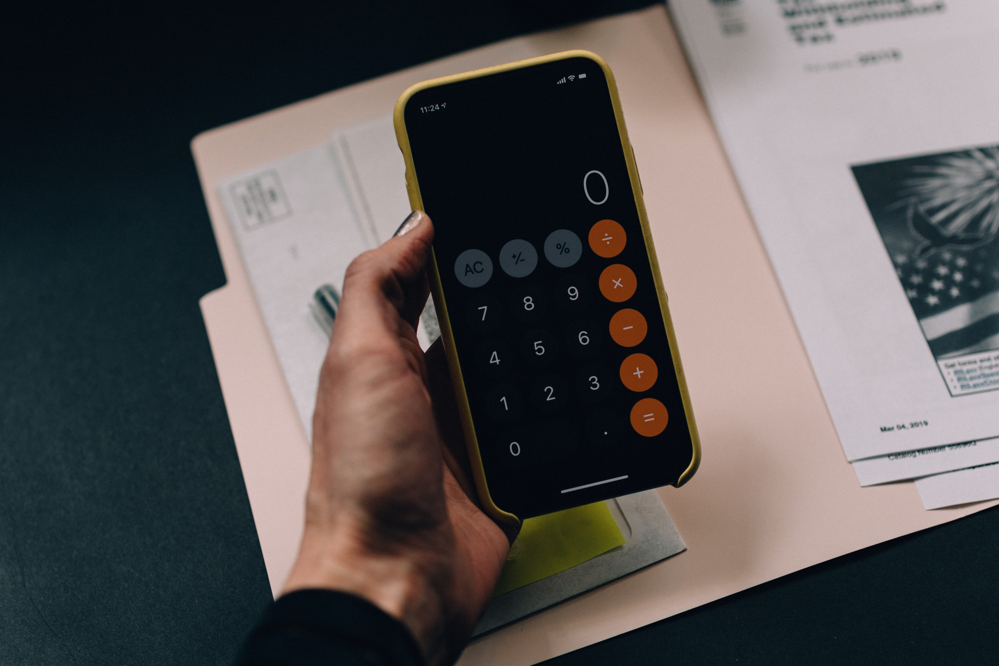

# Build and Compare

The purpose of these sessions is to explain and inspire others by challenge ourselves and explain to one and each other why you made specific choices.

Oh, and to have fun together! 🎈🎉

## Sessions:

- [Build a onscreen numpad](#build-a-onscreen-numpad)
- [Build a "Aap Noot Mies" with sound](#aap-noot-mies)

### Build a onscreen numpad

*Thanks to Kelly Sikkema for sharing their work on Unsplash*

Our challenge was to create a numpad (numeric input board).
We could get bonus points if we would add the calculation and memory keys.

#### 📹 Video 

#### Created version

| Creator  | Demo link  |
|---|---|
| [Sander Elias](https://twitter.com/esosanderelias) | [Link](https://stackblitz.com/edit/dag-numpad)  |
| [Dennis van den Berg](https://twitter.com/@devdbe) (showed by [Michiel Kikkert](https://twitter.com/Dutch_Guy))   |  [Link](https://stackblitz.com/github/dlvandenberg/devdbe-numpad) |
| [Frank Anneveld](https://twitter.com/FrankAnneveld)  | [Link](https://stackblitz.com/github/frankanneveld/numpad)  |
| [Jeffrey Bosch](https://twitter.com/jefiozie)  |  [Link](https://stackblitz.com/edit/dag-nummpadd) |

### Aap Noot Mies

_information will be added just before or after the show_

